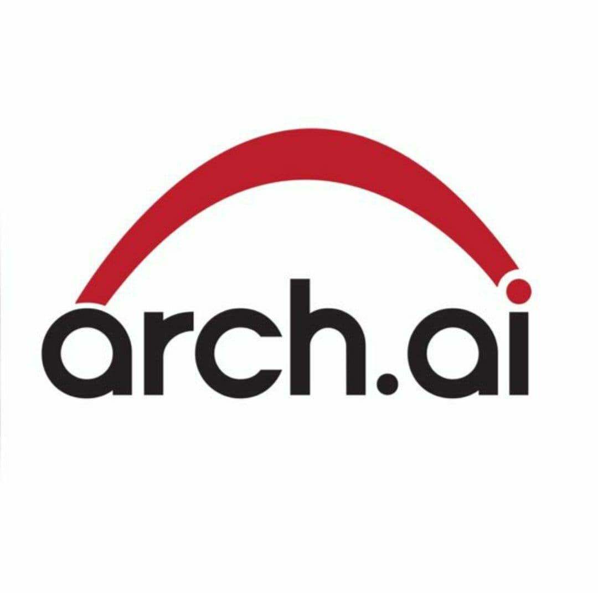

# AI Club GECT Website - arch.ai
### `Envisioning a new era of Artificial Intelligence`

## Setup
### Development
1. `yarn install` or `npm install`
2. `yarn start` or `npm start`

### Production
1. `yarn deploy` or `npm run deploy` on master branch.

### Docker and VSCode
1. Install Docker
2. Install vscode extension [Remote - Container](https://marketplace.visualstudio.com/items?itemName=ms-vscode-remote.remote-containers).
3. Open the workspace in container: automatically downloads and install working environment.
4. `yarn start` for development and `yarn deploy` for production.

 

This website is maintained by [AI Club GECT](https://aiclub.github.io/aiclub-gect-website/). Feel free to pull request or raise issues. We believe in **"Inspire, Learn and Collaborate"**.